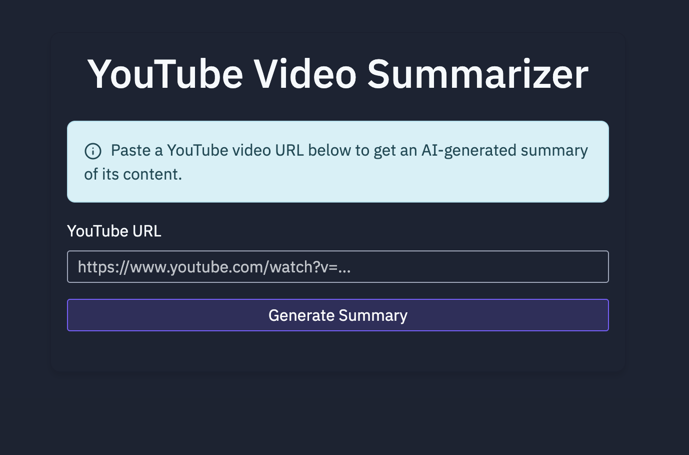

# Video Summarizer - User Guide

This application allows you to summarize YouTube videos by generating concise summaries using AI. The app extracts the transcript from YouTube videos and processes it with OpenAI's GPT-4o model to create structured summaries.



## Prerequisites

Before you can run this application, you need to have the following installed:

- Python 3.11 or higher
- pip (Python package manager)
- pipenv (Python virtual environment and package manager)

## Setup Instructions

### 1. Clone the Repository

```bash
git clone https://github.com/weijianzhg/youtube-summariser
cd youtube-summariser
```

### 2. Install pipenv (if not already installed)

```bash
pip install pipenv
```

### 3. Install Dependencies

The project uses Pipfile for dependency management. To install all dependencies:

```bash
# Install dependencies from Pipfile
pipenv install
```

This will:
- Create a virtual environment if it doesn't exist
- Install all dependencies specified in the Pipfile
- Create/update Pipfile.lock with exact versions

### 4. Activate the Virtual Environment

After installing dependencies, activate the virtual environment:

```bash
pipenv shell
```

### 5. Set Up Environment Variables

The application requires the following environment variables:

- `OPENAI_API_KEY`: Your OpenAI API key
- `SESSION_SECRET`: A secret key for Flask sessions

You can set these variables in your terminal:

```bash
# On Windows (PowerShell)
$env:OPENAI_API_KEY="your_openai_api_key"
$env:SESSION_SECRET="your_secret_key"

# On macOS/Linux
export OPENAI_API_KEY=your_openai_api_key
export SESSION_SECRET=your_secret_key
```

Alternatively, create a `.env` file in the project root directory:

```
OPENAI_API_KEY=your_openai_api_key
SESSION_SECRET=your_secret_key
```

### 6. Running the Application

Start the application by running:

```bash
python main.py
```

This will start the Flask development server on `http://0.0.0.0:5001/`.

You can access the application by opening a web browser and navigating to:
- `http://localhost:5001/` (if accessing from the same machine)
- `http://your-ip-address:5001/` (if accessing from another device on the same network)

### 7. Using the Application

1. Enter a YouTube URL in the input field
2. Click the "Summarize" button
3. Wait for the application to process the video and generate a summary
4. View the structured summary of the video content

## Troubleshooting

- **API Key Issues**: Ensure your OpenAI API key is valid and has sufficient credits
- **YouTube Transcript Errors**: Some videos may not have transcripts available or may have disabled transcript access
- **Port Conflicts**: If port 5001 is already in use, you can specify a different port using the `--port` argument
- **Dependency Issues**: If you encounter any dependency-related issues, try:
  ```bash
  pipenv clean
  pipenv install
  ```

## Additional Information

- The application uses Flask as the web framework
- Video transcripts are extracted using the YouTube Transcript API
- Summaries are generated using OpenAI's GPT-4o model
- The application is configured for development use with debug mode enabled
- Dependencies are managed using Pipfile and Pipfile.lock for deterministic builds